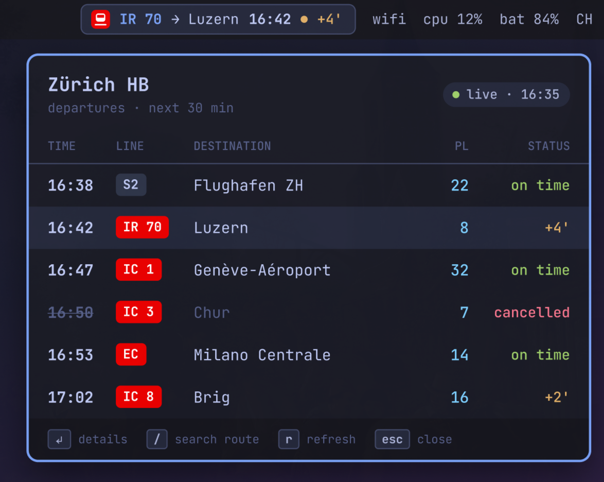
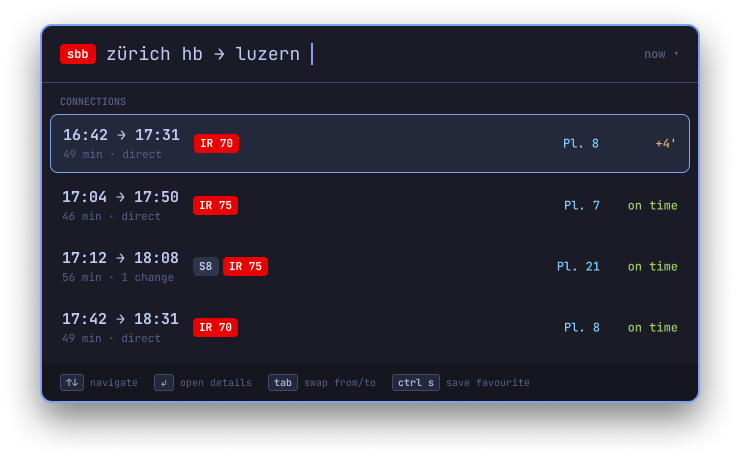

# Deutsche Bahn for Omarchy

Your next German train, right in the Omarchy bar. Know whether the ICE 507 is on
time *before* you sprint to platform 8, not after.

<p align="center">
  
</p>

## What you get

- **A bar pill** with your next train: line, destination, time, and a countdown.
  Late? It says `+4'`. Cancelled? It says so, sadly.
- **Follow your commute.** Don't care about every train leaving your station?
  Set a route like `Berlin Hbf > Leipzig Hbf` and the pill and board show only the next
  connections for it, changes included.
- **A departures board** (click the pill). Hit `Enter` on a train to see its
  stops and whether the platform changed on you.
- **Route search** (right click). Type `Leipzig Hbf`, or `Berlin Hbf > Leipzig Hbf`, press
  `Enter`, done. Pick "in 30 min" if you're running late on purpose.
- **Favourite routes.** `ctrl s` saves one, `ctrl 1`–`9` brings it back.
- **Delay alerts.** A notification when your train is late or cancelled, so
  you can finish your coffee.
- **Settings inside the popup** (`,` on the board). No config files needed.

<p align="center">
  
</p>

## Install

```sh
omarchy plugin add https://github.com/vvkycodevv/omarchy-db.git --enable
```

It shows up on the right of the bar. Prefer the middle?

```sh
omarchy bar move vvkycodevv.db --section center
```

## Driving it

| Where | Keys |
| --- | --- |
| Pill | left click: board · right click: route search · middle click: refresh |
| Board | `↑↓` pick a train · `Enter` details · `/` search · `r` refresh · `,` settings · `Esc` close |
| Route search | `Enter` search / open a connection · `Tab` swap from and to · `ctrl s` save favourite · `ctrl t` later departures · `ctrl 1`–`9` favourites · `Esc` back or close |
| Settings | `↑↓` move · `Enter` edit or toggle · `x` delete a favourite · `Esc` back |

## Settings

Change them in the popup (`,` on the board), in Setup > Bar, or in the widget's
entry in `~/.config/omarchy/shell.json`.

| Key | Default | What it does |
| --- | --- | --- |
| `homeStation` | `Berlin Hbf` | Where the board and pill look for trains |
| `barMode` | `Home station` | `Route` follows `barRoute` instead of the whole station |
| `barRoute` | empty | `From > To`, e.g. `Berlin Hbf > Leipzig Hbf`; just `Leipzig Hbf` starts at `homeStation` |
| `barDestination` | empty | Home station mode: only follow trains that stop here, e.g. `Leipzig Hbf` |
| `barStyle` | `Full` | `Compact` keeps just the time and status |
| `showInBar` | `true` | `false` leaves only the little train icon |
| `palette` | `Figma` | `Theme` follows your Omarchy theme instead of Tokyo Night |
| `departures` | `8` | Trains on the board (3–20) |
| `connections` | `5` | Results per route search, favourites too (1–10) |
| `refreshSeconds` | `60` | How often to check the timetable |
| `delayAlertMinutes` | `3` | Notify at this delay; `0` means "don't tell me" |
| `badgeStyle` | `Rail red` | `Theme` for calmer line badges |
| `favourites` | empty | `From > To`, separated by `;`, e.g. `Berlin Hbf > Leipzig Hbf; Hamburg Hbf > Bremen Hbf` |
| `shortcuts` | `true` | Register the keyboard shortcuts below |
| `boardShortcut` | `SUPER + ALT + T` | Opens the board |
| `searchShortcut` | `SUPER + ALT + R` | Opens the route search |
| `favouriteShortcut` | `SUPER + CTRL + ALT` | Modifiers for favourites 1–9 |

## Keyboard shortcuts

They set themselves up. No config editing, no copy-paste:

| Keys | Does |
| --- | --- |
| `super+alt+t` | Departures board (press again to close) |
| `super+alt+r` | Route search (same deal) |
| `super+ctrl+alt+1`–`9` | Favourite route 1–9 |

Already using one of those keys for something else? The plugin backs off: it
skips that key, keeps yours, and sends you a notification saying which one.

Want different keys? Set `boardShortcut`, `searchShortcut` or
`favouriteShortcut` (just the modifiers, like `SUPER + CTRL + ALT`). Leave one
empty to switch it off, or flip "Keyboard shortcuts" off in the settings to
turn them all off.

The fine print: the shortcuts are live bindings, not lines in your config, so
they only exist while the widget is on your bar.

The same things work from any script:

```sh
omarchy-shell vvkycodevv.db route "Berlin Hbf" "Leipzig Hbf"
omarchy-shell vvkycodevv.db favourite 1
omarchy-shell vvkycodevv.db settings
omarchy-shell vvkycodevv.db refresh
```

## Good to know

- Timetable data comes from [v6.db.transport.rest](https://v6.db.transport.rest):
  a Deutsche Bahn-compatible API that is free and needs no API key.
- It needs `curl` and `notify-send`, both already on Omarchy.
- Every response is size-capped (1 MB for timetables, 64 KB for station
  search, 512 KB for the Hyprland shortcut list) and dropped unread if it
  goes over, so a misbehaving server can't balloon the shell.
- The only file it writes is your own `shell.json`, when you change a setting
  or save a favourite. Shortcuts go straight to Hyprland (`hyprctl eval`), not
  into your config files. No daemon, no sudo.
- Like every Omarchy plugin, it runs unsandboxed with your user permissions.

## Remove

```sh
omarchy plugin remove vvkycodevv.db
```

No hard feelings. The trains will keep running without you.

## Hacking on it

```sh
git clone https://github.com/vvkycodevv/omarchy-db.git ~/.config/omarchy/plugins/vvkycodevv.db
TZ=Europe/Berlin node tests/model.test.js
omarchy plugin validate ~/.config/omarchy/plugins/vvkycodevv.db
```

After editing the QML, run `omarchy restart shell` if a change doesn't show up.

---

Not affiliated with Deutsche Bahn AG. Just a fan of trains that leave on time.
